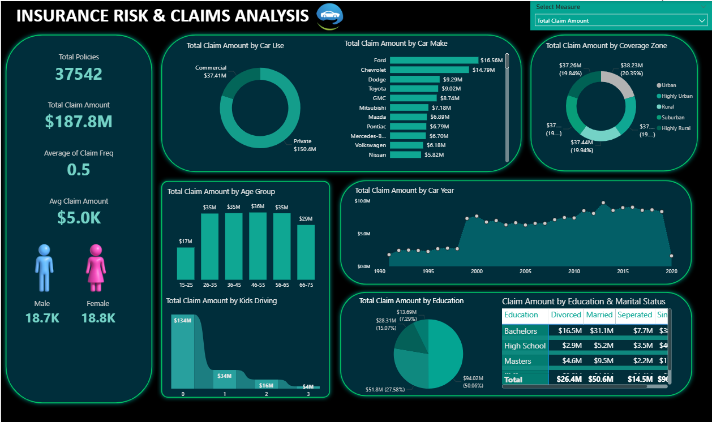

# Insurance Data Analysis – Power BI

## 📌 Project Overview
This project focuses on end-to-end insurance data analysis using Power BI. It includes domain understanding, business requirements, data preparation, data modeling, and interactive dashboard creation to support business decision-making.

---

## 📄 Domain & Business Understanding
The project is developed based on proper insurance domain study and clearly defined business requirements.

### Documents Included:
- **Domain Doc.docx** – Explains insurance domain concepts, terminology, and business context.
- **Business Requirements.docx** – Defines project objectives, KPIs, metrics, and stakeholder expectations.

---

## 📊 Dataset Information
The analysis is performed using an insurance policy dataset containing customer and policy-related details.

**Dataset File:**
- **insurance_policies_data.xlsx**

**Dataset Includes:**
- Policy details  
- Customer information  
- Premium amounts  
- Claim status  
- Region / category details  

---

## 🛠 Tools Used
- Power BI
- Microsoft Excel

---

## 📁 Project Files
- **insurance bi project.pbix** – Power BI dashboard file  
- **insurance_policies_data.xlsx** – Raw dataset  
- **Domain Doc.docx** – Domain understanding  
- **Business Requirements.docx** – Business requirements  
- **Dashboard.png** – Dashboard preview image  

---

## 📸 Dashboard Preview

---

## ✅ Conclusion
This project demonstrates a complete data analysis workflow starting from domain understanding and business requirement analysis to building meaningful and interactive Power BI dashboards.

